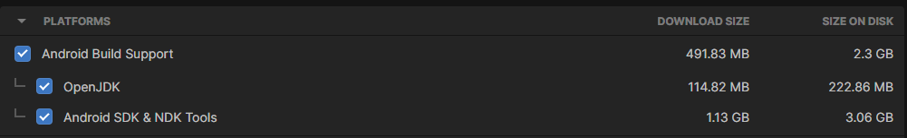
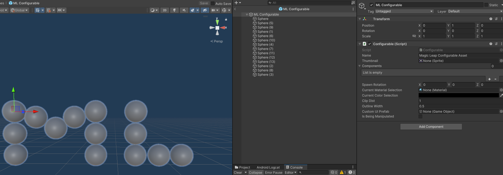
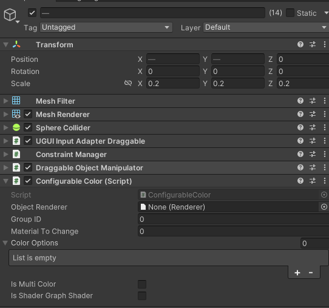
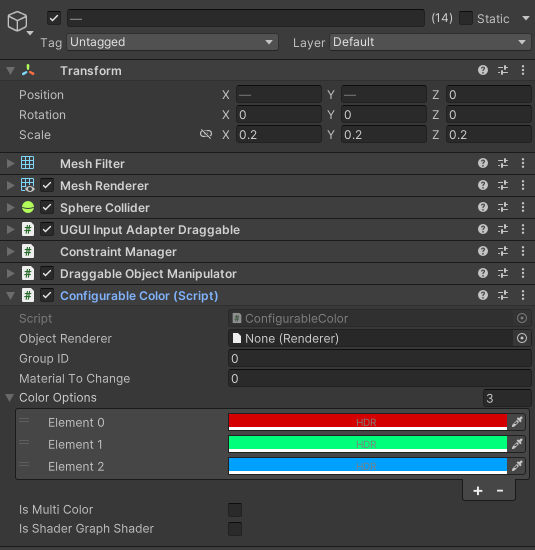
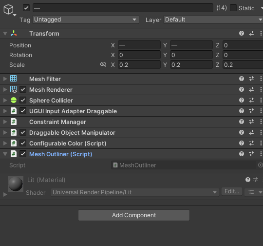
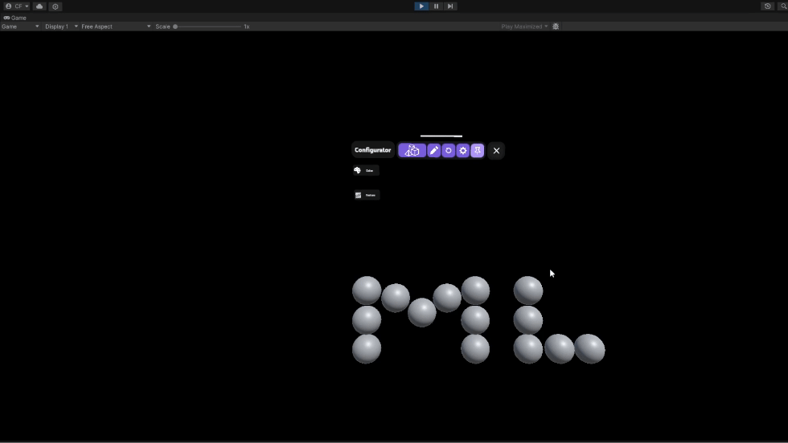
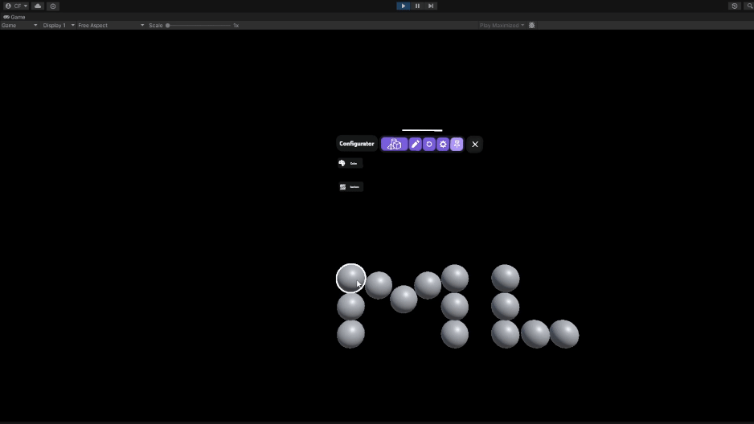
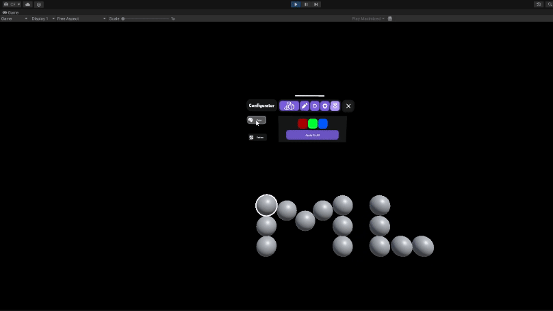
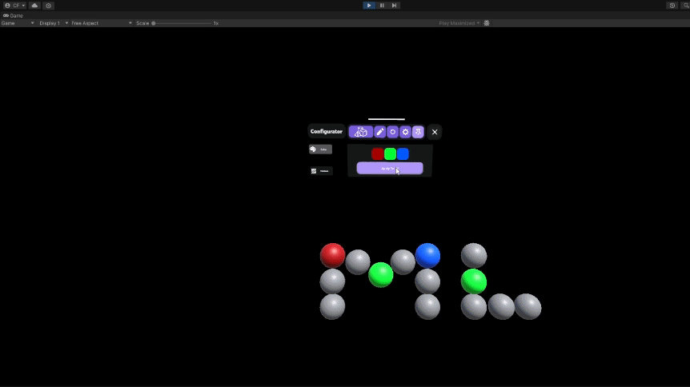

# Configurator

The Configurator is a Unity-based augmented reality project tailored for **Magic Leap 2** devices. It serves as a comprehensive guide for developers, demonstrating the integration of **Magic Leap 2** features and **MRTK3** for interactive object manipulation and user interface design within Unity.

### Key Features

- Integration of Magic Leap 2 features such as Global Dimming, Segmented Dimming, and real-world surface detection.
- Implementation of **MRTK3** for enhanced object interaction.
- A versatile framework allowing runtime customization of 3D assets, including color, texture, and animations.

## Installing Unity

1. Download and install [Unity version 2022.3.67f2](https://unity.com/releases/editor/archive)
2. During  the installation, select the Android Build Support module, including OpenJDK and Android SDK & NDK Tools.

## Getting Started

1. Clone the repository, ensure you have git LFS installed as well since this repo uses it to store some assets.
2. Open the project using Unity version 2022.3.67f2.
3. By default, the project opens with the Main scene loaded. To test the project, click 'Play' in the Unity Editor.
4. To deploy the project to a Magic Leap 2 device, use Unity's Build and Run feature with the device connected.

## Developer Guide

The Configurable system is designed to be flexible and extensible, allowing any 3D asset to become highly customizable. This section includes information on using and creating custom configurable assets. By default the system can configure the following properties at runtime:

- Changing the color
- Changing the material/texture
- Triggering animations
- Changing the position/rotation of an asset via predefined 'layouts'

### Configurables Architecture

The configuration system is comprised of three main components:

1. **Configurable**: The root object that manages Configurable Components and shared actions (e.g., select/deselect, reset to default states).

2. **Configurable Components**: Self-contained scripts that  define specific customization behaviors (e.g., changing colors, materials, triggering animations).

3. **Interactable Components**: MRTK3 components enabling user interaction, like `ObjectManipulator` or `DraggableObjectManipulator`.

### Creating a Configurable Asset

To make a 3D asset configurable:

#### Step 1: Attach the Configurable Script
- Add the `Configurable` componenet to the root object of your 3D model.
- This script serves as the foundation for further customization options.

#### Step 2: Enable Color Customization

- Add the `ConfigurableColor` componenet to any child object you want to be able to alter the color of.
- This action automatically adds MRTK3 components like DraggableObjectManipulator, UGUI Input Adapter Draggable, and Constraint Manager. These are MRTK components for detecting user interaction.

#### Step 3: Define Color Options

- Specify the color variations available for the asset.
- These options will be presented to the user for selection during runtime.

#### Step 4: Add Object Outlining (Optional)

- To enhance user experience, you can add an outline effect to the asset when hovered over.
- Add the `MeshOutliner` component to achieve this visual cue.

#### Step 5: Finalize and Test Your Configurable Asset

- After completing the above steps, add the asset to the 'configurables prefab list' in the Main scene. 
- This allows you to test the configuration options directly.
- For integration into your own projects, ensure you have a UI system in place to interact with these configuration features.

|  |  |
|--------------------------------------------------------|--------------------------------------------------------|
|  |  |

# License and Notices

- [License](license.txt)
- [Notices](NOTICE.txt)
